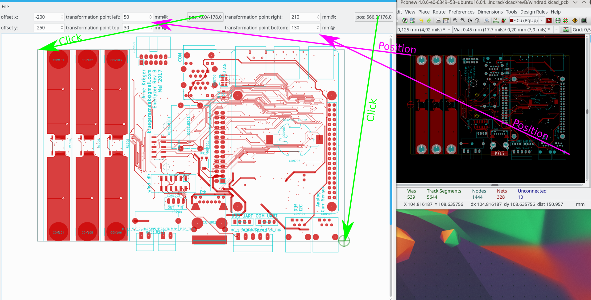

# Solder Tool

## Introduction

When soldering with the help of this tool it is much easier and faster to find the right place on a PCB. I made the
experience that most of time used for soldering a PCB is consumed by locating the right place and flipping the
layout image in my mind in case the part is placed on the bottom side. This is done now by the Kicad Solder Tool.

## How to

### Opening and sorting
After opening a *.kicad_pcb you will get a view of the PCB and a list of the parts to be placed. The list is sorted
by the placement-side(the side with most parts is listed at top), the area size of the pads(the part with smallest part is at top)
and it is grouped by the value of the part.

Since the order of the list corresponds mostly with the order you would solder your parts on the PCB, you should now
sort your part-bags on your desk in the same order as in the list.

### Calibration
The tool still needs to know the graphical transformation from the PCB-coordinate-system to the image-coordinates.
It needs 2 points for this.
You have to find 2 points (e.g. top-left-corner and bottom-right-corner) on the PCB and enter their PCB coordinates
in the edit fields. To tell the tool their image coordinates you click first on the corresponding button
and then the point within the image. As soon as you do this for both points the tool knows where to guide you when you
select a part in the partlist.

### Usage

Now you can select the first part of the partlist. A blinking circle will guide you to the right place of the PCB. If it is placed on the bottom side
the image display is mirrored along the vertical axis.
By pressing the [space] key the selected part is checked and the selection progresses to the part beneath.

## How to start / or dependencies

Following Python-Modules are used:
* Pyside
* minidom
* Kicad (tested with Kicad 4.0.6)

start the program with ./KicadSolderTool.py

